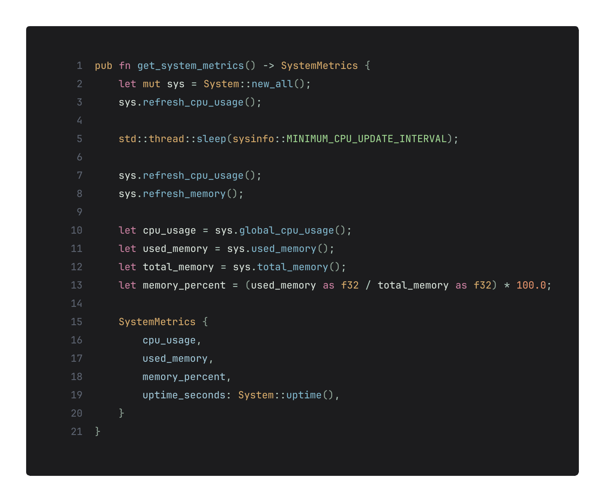

<h1 align='center'>
    shale.nvim
</h1>

<p align='center'>
  <b>A clean, dark, pleasant Neovim theme based on shale rocks</b>
</p>




## Installation

Install using your favorite plugin manager

```lua
{
  "smit4k/shale.nvim",
  lazy = false,
  priority = 1000,
  opts = {},
}
```
